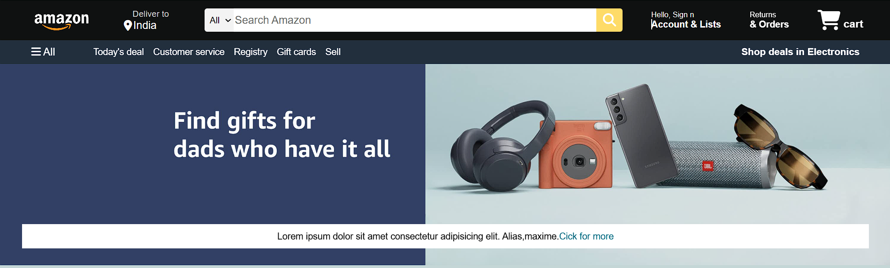
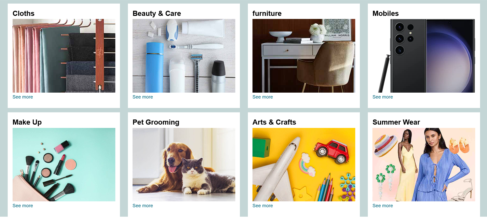
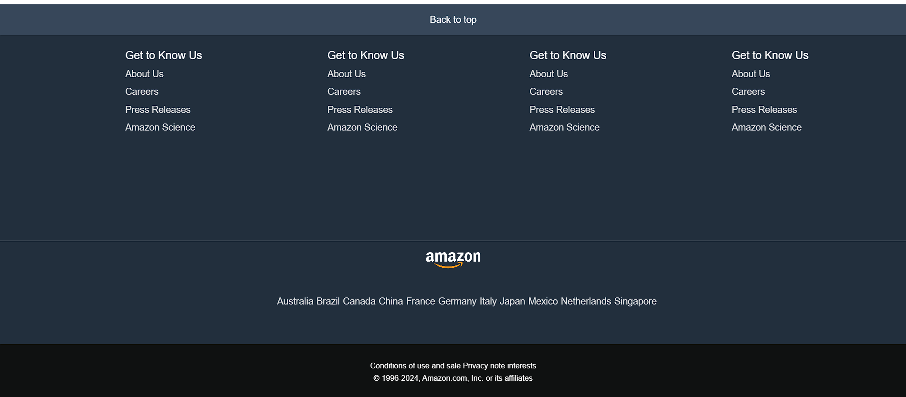

# Amazon.com ~ Clone

## Overviews
Amazon.com clone is a simple clone of famous e-commerce website Amazon.com built using HTML and CSS. It aims to replicate the design and layout of Amazon's main page while ensuring responsiveness across different devices. The project provides users with an interactive and visually appealing shopping experience. The homepage consists of a navigation bar, a search bar, a shopping cart icon, product categories, and a footer section. By utilizing modern web technologies, this project demonstrates the fundamental concepts of front-end development and UI/UX design.

## Feature
- **Responsive Navigation Bar**: Includes a search bar, sign-in section, and cart icon.
- **Hero Section**: Displays a featured banner.
- **Product Categories**: Various shopping categories with images and links.
- **Footer Section**: Contains useful links and additional information.
- **Hover Effects**: Interactive hover effects for better user experience.

## Technologies Used
- **HTML5**: For structuring the webpage.
- **CSS3**: For styling and layout.
- **Font Awesome**: For icons.
- **Google Fonts**: For better typography.

## Folder Structure
```
Amazon-Clone/
│── index.html       # Main HTML file
│── style.css        # Stylesheet for the project
│── Images/          # Directory containing images used
│── Screenshots/     # Directory containing project screenshots
```

## Screenshots
Here are some previews of the project:






